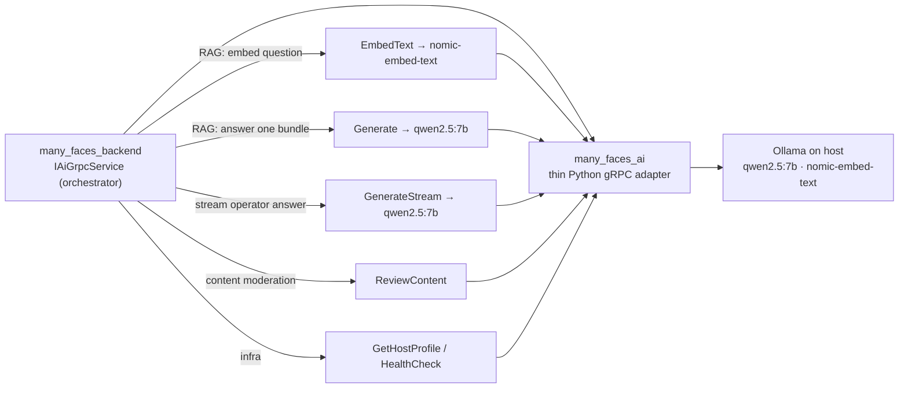

# Many Faces AI Service

<!-- readme-badges:start -->

[](./VERSION)


[](https://github.com/01laky/many_faces_main/actions/workflows/ci.yml)


<!-- readme-badges:end -->

**Version:** [`0.10.0`](./VERSION) · [Changelog](./CHANGELOG.md) · [Capability roadmap](./docs/capability-roadmap-v0.9.0.md)

**Author:** Ladislav Kostolny · [01laky@gmail.com](mailto:01laky@gmail.com)

> **Local AI adapter for Many Faces AI.** Exposes the gRPC surface `many_faces_backend` uses for operator chat generation, RAG embeddings, content moderation review, and AI worker health profiling. Inference runs in **Ollama on the host** — the container stays lightweight. **No public HTTP** — only `many_faces_backend` should call this service.

---

## Quick Start

```bash
# Full stack (recommended)
cd many_faces_main
./scripts/start-all-dev.sh

# Standalone
cd many_faces_ai
./scripts/start-dev.sh
```

**gRPC port:** `localhost:50051` · **Ollama** must be running on the host at `OLLAMA_HOST`

---

## Architecture



**This service is stateless.** It never reads the database, never calls Elasticsearch, and never publishes content. The **backend orchestrates** everything — this worker only **generates** and **embeds**.

---

## Three Pillars

| Pillar              | Highlights                                                                                                                                                                                                                                                                                             |
| ------------------- | ------------------------------------------------------------------------------------------------------------------------------------------------------------------------------------------------------------------------------------------------------------------------------------------------------ |
| **Security (AIH1)** | Internal **gRPC only** — no public HTTP; optional **`x-ai-worker-token`** metadata auth; **TLS** via `GRPC_TLS_CERT_FILE`; SSRF guards on public stats fetch; moderation input sanitization. CI: `node ../scripts/verify-ai-security-tests.mjs`.                                                       |
| **AI capabilities** | **Live:** `EmbedText` (RAG vectors) · `Generate` (batched map+stitch) · `GenerateStream` (token streaming) · `ReviewContent` (advisory moderation) · `GetHostProfile` / `HealthCheck`. **Available, not yet wired:** `ChatRiskScore`, `GenerateReport`, `BuildFaceContextSnapshot`, `ExplainDecision`. |
| **Configuration**   | `OLLAMA_HOST`, model names, timeout, max tokens via env; **low-VRAM tuning** (`OLLAMA_KEEP_ALIVE=-1`, `OLLAMA_NUM_GPU`, `OLLAMA_FLASH_ATTENTION`, `OLLAMA_KV_CACHE_TYPE`).                                                                                                                             |

---

## Why This AI Design

| Strength                              | What it means                                                                                                                                                                |
| ------------------------------------- | ---------------------------------------------------------------------------------------------------------------------------------------------------------------------------- |
| **Fully local**                       | Ollama on the host — privacy, no per-token cost, works offline                                                                                                               |
| **RAG, not prompt-stuffing**          | Operator chat **embeds the question** and retrieves only relevant data (ES kNN+BM25, RRF) — no full data dump into context                                                   |
| **Exact numbers, never hallucinated** | Embeddings only **route** to the right data; **figures are loaded fresh and deterministically** by the backend — the model narrates, never invents counts                    |
| **Tuned for small local models**      | **Batched map+stitch** feeds the 7B one focused chunk at a time; **fast-paths** answer count/single-bundle questions with 0–1 generations; answer **streams** token-by-token |
| **Advisory-only**                     | The worker only recommends; `SUPER_ADMIN` finalizes moderation; AI never publishes; two trust models (untrusted user content vs trusted operator) never mixed                |
| **SUPER_ADMIN-only**                  | All AI features live in the admin surface; no user-facing AI                                                                                                                 |

---

## AI Paths — Two Separate Pipelines

| Path                        | RPCs                                        | Purpose                                                                                                                         |
| --------------------------- | ------------------------------------------- | ------------------------------------------------------------------------------------------------------------------------------- |
| **Operator RAG chat**       | `EmbedText` + `Generate` + `GenerateStream` | Threaded operator chat: embed question → retrieve stat bundles from ES → load fresh values → batched map+stitch → stream answer |
| **User content moderation** | `ReviewContent`                             | Albums/blogs/reels approval queue — advisory; untrusted content, **never** mixed with the operator path                         |

---

## Performance on a Local 7B

On a dedicated **RTX 3050 4 GB + Ryzen 7** box: ~90–120 s for a full answer. Three optimizations:

| Optimization                | How                                                                                                     |
| --------------------------- | ------------------------------------------------------------------------------------------------------- |
| **Fewer generations**       | Count fast-path = **0** generations; single-bundle fast-path = **1**                                    |
| **Faster generations**      | `OLLAMA_KEEP_ALIVE=-1` keeps model resident; 96-token map cap; `MaxParallelBundleAiCalls=1` on 4 GB GPU |
| **Lower perceived latency** | `GenerateStream` → token-by-token in admin UI as it generates                                           |

**GPU tuning (4 GB VRAM):** `OLLAMA_NUM_GPU=20` (partial offload), `OLLAMA_FLASH_ATTENTION=1`, `OLLAMA_KV_CACHE_TYPE=q8_0`, `OLLAMA_NUM_CTX=4096`.

**Optional 3B helper:** `num_gpu=0` + `OLLAMA_MAX_LOADED_MODELS=2` — CPU-resident for gating decisions, no GPU contention.

**Full guide:** [`../docs/guides/operator-ai-performance.md`](../docs/guides/operator-ai-performance.md)

---

## Content Moderation Role

The `ReviewContent` RPC is an **advisory** classifier for user-created albums, blogs, and reels. This service:

- Receives bounded review requests from the backend worker (content type, titles, descriptions, media URLs, moderation version)
- Normalizes untrusted input via `moderation_input_sanitize.py` before classification (control + bidi stripping, length caps)
- Returns structured decision: `approve` / `reject` / `needs_human_review` with confidence, risk level, flags, safe user-facing message, model version, trace id
- **Never** writes to PostgreSQL, never publishes content, never auto-approves

**Safety rule:** AI recommends → backend policy validates → `SUPER_ADMIN` finalizes.

**Guide:** [`../docs/guides/ai-assisted-content-approval.md`](../docs/guides/ai-assisted-content-approval.md)

---

## Security (AIH1)

- Internal **gRPC only** — no public HTTP API; backend is the sole intended caller.
- Optional **`x-ai-worker-token`** metadata auth; hardened profile requires it at startup.
- Optional **gRPC TLS** via `GRPC_TLS_CERT_FILE` / `GRPC_TLS_KEY_FILE`.
- `ReviewContent` runs PI-4 sanitization on untrusted creator fields before classification.
- `FetchPublicStats` applies worker-side SSRF policy (HTTPS for public, loopback HTTP in dev only).
- Prompt and token caps; optional in-process rate limit on hot RPCs.
- Security regression tests: `tests/**/*_security.py` — run `node ../scripts/verify-ai-security-tests.mjs` from monorepo root.

Full guide: [`docs/SECURITY.md`](./docs/SECURITY.md)

---

## Tech Stack

| Layer            | Technology                             |
| ---------------- | -------------------------------------- |
| Language         | Python 3.11                            |
| RPC framework    | gRPC (`grpcio` 1.80)                   |
| Serialization    | Protocol Buffers (`grpcio-tools`)      |
| Inference        | Ollama HTTP API (local host)           |
| Generation model | `qwen2.5:7b-instruct-q4_K_M` (default) |
| Embedding model  | `nomic-embed-text`                     |
| Tests            | pytest                                 |
| Proto contracts  | Nested `many_faces_proto` submodule    |

---

## Project Structure

```
many_faces_ai/
├── proto/                            # Generated Python stubs (from many_faces_proto)
├── scripts/                          # proto generation, Docker dev, lint, verify-ci
├── server.py                         # gRPC server — all RPC servicers
├── moderation_input_sanitize.py      # Untrusted-field normalization for ReviewContent
├── test_server.py                    # gRPC servicer tests (pytest)
├── test_moderation_input_sanitize.py # Sanitizer unit tests
├── services/
│   └── ai_model_service.py           # Ollama HTTP adapter (generate + embed)
├── tests/                            # Security regression tests (AIH1)
├── requirements.txt                  # Python dependencies
├── Dockerfile.dev                    # Dev image
└── docs/
    ├── SECURITY.md                   # AIH1 security guide
    ├── host-profile.md               # GetHostProfile RPC + admin panel wiring
    ├── operator-live-stats-map-reduce.md  # Legacy — replaced by RAG
    └── capability-roadmap-v0.9.0.md  # Roadmap
```

---

## Getting Started

### Running in Docker (Recommended)

```bash
./scripts/start-dev.sh
```

Starts the gRPC server container at `localhost:50051`. Ollama must run on the host.

```bash
./scripts/stop-dev.sh     # stop
./scripts/clear-dev.sh    # stop + remove containers and images
./scripts/rebuild-dev.sh  # rebuild without starting
```

### Without Docker

```bash
pip install -r requirements.txt
./scripts/generate_proto.sh   # generate proto stubs
python3 server.py
```

### Model Selection

```bash
# Default
export OLLAMA_MODEL="qwen2.5:7b-instruct-q4_K_M"
export OLLAMA_BASE_URL="http://host.docker.internal:11434"

# Low-VRAM tuning (4 GB GPU, partial offload)
export OLLAMA_NUM_CTX=4096
export OLLAMA_NUM_THREAD=8
export OLLAMA_NUM_GPU=20
export OLLAMA_NUM_BATCH=128
export OLLAMA_KEEP_ALIVE=-1
export OLLAMA_FLASH_ATTENTION=1
export OLLAMA_KV_CACHE_TYPE=q8_0
```

Model weights live in **Ollama's model store**, not inside this container — recreating the container does not delete the model.

---

## Configuration

| Variable                   | Purpose                                     |
| -------------------------- | ------------------------------------------- |
| `OLLAMA_HOST`              | Ollama HTTP base URL                        |
| `OLLAMA_MODEL`             | Generation model name                       |
| `OLLAMA_NUM_CTX`           | Context window tokens                       |
| `OLLAMA_NUM_GPU`           | GPU layers to offload                       |
| `OLLAMA_KEEP_ALIVE`        | Set `-1` to keep model resident             |
| `OLLAMA_FLASH_ATTENTION`   | Enable flash attention (low-VRAM)           |
| `OLLAMA_KV_CACHE_TYPE`     | KV cache precision (`q8_0` for 4 GB)        |
| `GRPC_PORT`                | gRPC listen port (default `50051`)          |
| `GRPC_TLS_CERT_FILE`       | TLS certificate path (enables TLS)          |
| `GRPC_TLS_KEY_FILE`        | TLS private key path                        |
| `AI_WORKER_EXPECTED_TOKEN` | Required `x-ai-worker-token` metadata value |

---

## Testing

```bash
pytest                                          # all tests
pytest tests/ -k "security"                    # AIH1 security subset
node ../scripts/verify-ai-security-tests.mjs   # monorepo CI gate
```

---

## Documentation

| Doc                                                                                                    | Purpose                                                                 |
| ------------------------------------------------------------------------------------------------------ | ----------------------------------------------------------------------- |
| [`docs/SECURITY.md`](./docs/SECURITY.md)                                                               | AIH1 security guide — auth, TLS, SSRF, moderation, production checklist |
| [`docs/host-profile.md`](./docs/host-profile.md)                                                       | Host profile RPC and admin settings panel wiring                        |
| [`docs/operator-live-stats-map-reduce.md`](./docs/operator-live-stats-map-reduce.md)                   | **Legacy** map-reduce — degraded fallback; RAG is the live path         |
| [`docs/capability-roadmap-v0.9.0.md`](./docs/capability-roadmap-v0.9.0.md)                             | AI capability roadmap                                                   |
| [`../docs/guides/operator-ai-rag-retrieval.md`](../docs/guides/operator-ai-rag-retrieval.md)           | Full RAG architecture + reindex runbook                                 |
| [`../docs/guides/operator-ai-performance.md`](../docs/guides/operator-ai-performance.md)               | 7B tuning guide (GPU layers, flash attention, fast-paths)               |
| [`../docs/guides/admin-operator-ai-chat-threads.md`](../docs/guides/admin-operator-ai-chat-threads.md) | Operator chat threads, pagination, retention                            |
| [`../docs/guides/ai-assisted-content-approval.md`](../docs/guides/ai-assisted-content-approval.md)     | Content approval pipeline                                               |
| [`../docs/guides/operator-ai-skills.md`](../docs/guides/operator-ai-skills.md)                         | Skills routing (stats, reports, moderation Q&A, general)                |
| [`../docs/readmes/ai-grpc-overview.md`](../docs/readmes/ai-grpc-overview.md)                           | Monorepo-level AI gRPC overview                                         |

---

## Proto Contracts

Canonical `.proto` files live in the nested **`many_faces_proto`** submodule at `many_faces_ai/many_faces_proto/`.

```bash
git submodule update --init --recursive   # populate nested submodule
./scripts/generate_proto.sh               # regenerate Python stubs after proto changes
```

---

## Suggested Future Capabilities

| Capability                      | Description                                                                                     |
| ------------------------------- | ----------------------------------------------------------------------------------------------- |
| **Context snapshots**           | Backend-provided payload describing faces, routes, page schemas, roles, and operational signals |
| **Report generation**           | Typed RPCs for admin reports (face health, usage, content gaps)                                 |
| **Feature review**              | AI-assisted checks for face page completeness and grid safety                                   |
| **Chat risk scoring**           | Review of messages for spam, harassment, suspicious links, prompt-injection                     |
| **Explainable recommendations** | Responses that include reason, confidence, and source context                                   |
| **Audit-friendly logging**      | Request metadata and model decisions without leaking sensitive user content                     |

---

## Legacy: Operator Statistics RPCs

> **Legacy — replaced by RAG.** `inline`/`live` stats modes, `stats_context_json`, `FetchPublicStats`, and `OperatorStatsChat` are no longer used by the backend chat. The RAG path (`EmbedText` + `Generate`) replaced them. These RPCs remain on the worker for compatibility only.

---

## Project Status

Active AI adapter for the Many Faces AI monorepo. v0.10.0 — RAG operator chat (EmbedText + Generate + GenerateStream), content moderation (ReviewContent), skills routing, host profile, and full AIH1 security regression suite. Tracked in [`CHANGELOG.md`](./CHANGELOG.md).
