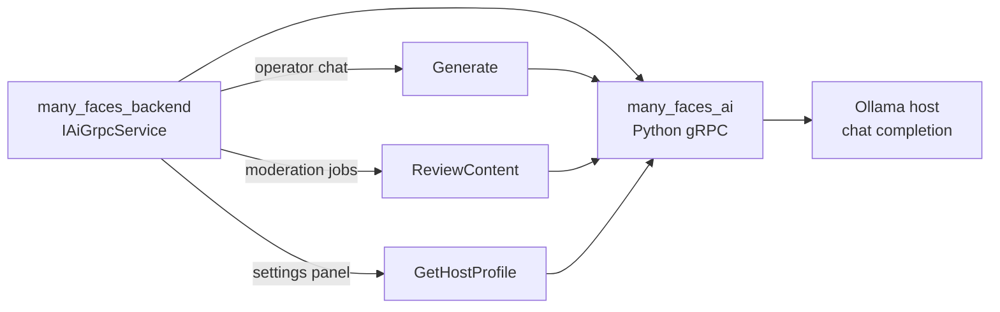

# Many Faces AI service - gRPC Server

<!-- readme-badges:start -->

[](./VERSION)


[](https://github.com/01laky/many_faces_main/actions/workflows/ci.yml)


<!-- readme-badges:end -->

**Version:** [`0.9.0`](./VERSION) · [Changelog](./CHANGELOG.md) · [Capability roadmap v0.9.0](./docs/capability-roadmap-v0.9.0.md)

**Author:** Ladislav Kostolny · [01laky@gmail.com](mailto:01laky@gmail.com)

**Local AI adapter for the Many Faces platform.** This Python service exposes the gRPC surface that the backend uses for operator chat generation, live statistics prompts, AI-assisted content review, and AI worker host profiling. The model itself runs in **Ollama on the host**; the container stays lightweight. **No public HTTP** — only `many_faces_backend` should call this service.

### Three pillars

| Pillar              | Highlights                                                                                                                                                                                                                                                               |
| ------------------- | ------------------------------------------------------------------------------------------------------------------------------------------------------------------------------------------------------------------------------------------------------------------------ |
| **Security (AIH1)** | Internal **gRPC only**; optional **`x-ai-worker-token`** metadata; **TLS** via `GRPC_TLS_CERT_FILE`; SSRF guards on public stats fetch; moderation output sanitization. CI: `node ../scripts/verify-ai-security-tests.mjs`. [`docs/SECURITY.md`](./docs/SECURITY.md).    |
| **AI capabilities** | **`Generate`** / **`GenerateStream`**; **`ReviewContent`** (rules + optional LLM); **`ChatRiskScore`**; **`BuildFaceContextSnapshot`**; **`GenerateReport`**; **`EmbedText`**; **`ExplainDecision`**; **`GetHostProfile`**; legacy **`OperatorStatsChat`** (deprecated). |
| **Configuration**   | **`OLLAMA_HOST`**, model name, timeout, max tokens via env; host profile exposed to admin; compose profile **`ai-dev`** in monorepo stack. Live stats: [`docs/operator-live-stats-map-reduce.md`](./docs/operator-live-stats-map-reduce.md).                             |

| Start here       | Link                                                                                 |
| ---------------- | ------------------------------------------------------------------------------------ |
| **Security**     | [`docs/SECURITY.md`](./docs/SECURITY.md) — trust boundaries, auth, TLS, SSRF         |
| Run standalone   | `./scripts/start-dev.sh`                                                             |
| Full stack       | `../scripts/start-all-dev.sh` from `many_faces_main`                                 |
| gRPC port        | `localhost:50051`                                                                    |
| Live stats guide | [`docs/operator-live-stats-map-reduce.md`](./docs/operator-live-stats-map-reduce.md) |



Python **gRPC adapter** providing **health checks**, optional **Ollama-backed text generation** (**`Generate`** with optional **`stats_context_json`**), **public JSON fetch** (**`FetchPublicStats`**), **operator stats chat** (**`OperatorStatsChat`**), and structured **`ReviewContent`** responses for the user-content moderation pipeline used by **many_faces_backend** (`many_faces_backend/`).

## Documentation in this repo

| Doc                                                                                  | Purpose                                                                      |
| ------------------------------------------------------------------------------------ | ---------------------------------------------------------------------------- |
| [`README.md`](./README.md)                                                           | This file — overview, roadmap, runbook.                                      |
| [`docs/SECURITY.md`](./docs/SECURITY.md)                                             | **AIH1** security guide — auth, TLS, SSRF, moderation, production checklist. |
| [`docs/operator-live-stats-map-reduce.md`](./docs/operator-live-stats-map-reduce.md) | Live stats map-reduce for operator chat.                                     |
| [`docs/host-profile.md`](./docs/host-profile.md)                                     | Host profile RPC and admin settings panel wiring.                            |

### Security at a glance

- Internal **gRPC only** — no public HTTP API; backend is the sole intended caller.
- Optional **`x-ai-worker-token`** metadata auth; hardened profile requires it at startup.
- Optional **gRPC TLS** via `GRPC_TLS_CERT_FILE` / `GRPC_TLS_KEY_FILE`.
- **`ReviewContent`** runs PI-4 sanitization on untrusted creator fields before classification.
- **`FetchPublicStats`** applies worker-side SSRF policy (HTTPS public, loopback HTTP in dev).
- Prompt / token caps and optional in-process rate limit on hot RPCs.
- Security regression tests: `tests/**/*_security.py` — run `node ../scripts/verify-ai-security-tests.mjs` from monorepo root.

Monorepo guides: [`docs/readmes/ai-grpc-overview.md`](../docs/readmes/ai-grpc-overview.md), [`docs/guides/admin-dashboard-metrics.md`](../docs/guides/admin-dashboard-metrics.md).

## Overview

The Many Faces AI service (**many_faces_ai**; monorepo path `many_faces_ai/`) is a Python-based **gRPC adapter**. The backend API (**many_faces_backend** / `many_faces_backend/`) connects on startup for **health verification**, optional **Ollama-backed `Generate`** (with optional **`stats_context_json`** for operator admin chat), **`FetchPublicStats`** / **`OperatorStatsChat`** when **live** public-statistics mode is enabled, and the **`ReviewContent`** contract used by the user-content moderation worker. Inference runs on a **host Ollama** instance (default **`qwen2.5:7b-instruct-q4_K_M`**), not inside this container.

In the broader Many Faces AI architecture, this submodule is the AI workspace for application-aware intelligence. **Implemented today:** gRPC **`Health`**, **`Generate`** (Ollama chat + optional aggregate JSON prefix), **`FetchPublicStats`** (HTTP GET helper), **`OperatorStatsChat`** (optional live fetch + **`Generate`**), and **`ReviewContent`** — a deterministic classifier over text and media URL metadata that returns approve / reject / needs-human-review with confidence, risk, flags, reasons, and optional **`image_analysis_boundary`** / **`video_analysis_boundary`** policy flags (placeholders for heavier CV models; this reference classifier does not treat them as sole auto-reject triggers). The longer-term direction is richer context snapshots, admin reports, and chat-security RPCs.

The goal is for the AI service to understand the application's structure instead of acting as a generic text generator. Future capabilities can use face configuration, page layouts, grid components, roles, content modules, and backend metadata as context for more useful responses. That makes the service a natural place for application-context summaries, admin-facing insights, feature recommendations, and guided diagnostics across the MFAI platform.

This README describes both the current service and the intended direction. The application-context, reporting, feature-management, and chat-security capabilities described below are roadmap items unless explicitly implemented in code.

## Role In MFAI

- **Application context intelligence:** build structured summaries of faces, pages, modules, routes, roles, and configuration so AI features can reason about the real app state.
- **Operational reports:** generate human-readable reports for admins, such as face health, missing configuration, inactive modules, content gaps, usage patterns, or security-relevant anomalies.
- **Feature management support:** help evaluate which features are enabled, incomplete, duplicated, risky, or ready to expose for a specific face or user role.
- **Chat security assistance:** support moderation, abuse detection, unsafe-content review, suspicious-message reporting, and policy-aware chat diagnostics.
- **Admin decision support:** provide explanations and recommendations that help operators understand what is configured, what is missing, and what should be reviewed next.
- **Developer diagnostics:** eventually assist with debugging cross-service behaviour by summarizing backend responses, frontend grid schemas, AI service state, and integration errors.
- **Safety-first AI boundaries:** keep AI outputs advisory by default, with backend-controlled enforcement for permissions, moderation decisions, and sensitive operations.

## Suggested Future Capabilities

The following areas would make the AI submodule more useful as the platform grows:

- **Context snapshots:** a backend-provided payload describing faces, routes, page schemas, available modules, roles, capabilities, and recent operational signals.
- **Report generation RPCs:** typed gRPC methods for generating admin reports instead of overloading free-form text generation.
- **Feature review workflows:** AI-assisted checks for whether a face has complete pages, useful grid composition, required modules, and safe defaults.
- **Chat risk scoring:** structured review of chat messages or conversations for spam, harassment, suspicious links, prompt-injection attempts, or policy violations.
- **Content approval recommendations:** implemented via `ReviewContent` (see below); backend owns enqueue, validation, and final status.
- **Explainable recommendations:** responses that include the reason, confidence, and source context behind each recommendation.
- **Audit-friendly logging:** request metadata and model decisions logged in a way that supports review without leaking sensitive user content unnecessarily.
- **Human approval flow:** AI can suggest moderation or configuration changes, but admin/backend workflows should approve any action that affects users or access rules.

## AI-Assisted Content Approval Role

The content approval workflow uses this service as an **advisory** reviewer for regular FE user-created albums, blogs, and reels. The service **never** publishes or deletes rows in PostgreSQL: it only answers `ReviewContent`. **many_faces_backend** (`many_faces_backend/`) enqueues Redis jobs, calls gRPC, validates ranges and policy, retries with backoff, and only `SUPER_ADMIN` (or future explicit auto-policy) may set final `ApprovalStatus`. Full process guide: [`docs/guides/ai-assisted-content-approval.md`](../docs/guides/ai-assisted-content-approval.md). Agent prompt for untrusted-content defenses (sanitization, heuristics, tests): [`docs/prompts/moderation-content-prompt-injection-defense-agent-prompt.md`](../docs/prompts/moderation-content-prompt-injection-defense-agent-prompt.md).

Target responsibilities:

- Receive bounded review requests from the backend worker (content type, titles, descriptions, media URLs, moderation version).
- Classify using deterministic rules plus URL heuristics; attach **boundary** flags when image/video analysis would require a heavier model later.
- **`ReviewContent` input path:** untrusted title, body, and media URL are normalized in-process via `moderation_input_sanitize.py` (control and bidi stripping, length caps) before keyword classification — mirroring the backend sanitizer for defense in depth.
- Return a structured decision: `approve`, `reject`, or `needs_human_review`.
- Include confidence, risk level, flags, internal reason, safe user-facing message, model version, and trace id.
- Avoid autonomous side effects; all durable state changes stay in the API.
- Support auditability with stable trace metadata; tests in `test_server.py`, `tests/test_*_security.py` (AIH1), and shared sanitize corpus.

Safety rule:

- AI recommends.
- Backend validates the recommendation.
- Admin/superadmin or explicit backend policy finalizes the moderation decision.

This keeps the AI service useful without making it an uncontrolled publisher.

## Operator statistics RPCs (admin assistant)

The **many_faces_backend** `ChatHub` may call these RPCs when a platform operator uses **admin AI chat** with **inline** or **live** public-statistics mode (see monorepo [`docs/guides/admin-dashboard-metrics.md`](../docs/guides/admin-dashboard-metrics.md)):

| RPC                     | Role                                                                                                                                                                                                                              |
| ----------------------- | --------------------------------------------------------------------------------------------------------------------------------------------------------------------------------------------------------------------------------- |
| **`Generate`**          | Same as chat completion; if **`stats_context_json`** is set, the servicer prepends a short English banner + JSON + separator **before** the conversational prompt.                                                                |
| **`FetchPublicStats`**  | **`GET`** the **`absolute_url`** (must be `http://` or `https://`). For **localhost / 127.0.0.1 / ::1** over HTTPS, TLS verification is relaxed for dev self-signed certs only.                                                   |
| **`OperatorStatsChat`** | If **`fetch_live_public_snapshot`**, calls **`FetchPublicStats`** first; builds **`GenerateRequest`** with optional **`stats_context_json`** and a final **`User:` / `AI:`** tail from **`user_message`** and **`history_text`**. |

**Proto:** canonical **`health.proto`** lives in the nested **`many_faces_proto`** submodule at **`many_faces_ai/many_faces_proto/proto/health.proto`**. Regenerate with **`scripts/generate_proto.sh`**; generated `*_pb2.py` files are gitignored — use a **`.venv`** with **`grpcio-tools`** when `python3 -m grpc_tools.protoc` is not available on the host.

**Tests:** `test_server.py` + **`tests/**/\*\_security.py`** (AIH1) cover **`Generate`**, **`FetchPublicStats`**, **`ReviewContent`\*\*, auth/TLS env, and SSRF policy.

## Features

- **gRPC Server**
  - High-performance RPC communication
  - Protocol Buffers for data serialization
  - Health check endpoint
  - **AI text generation** — **`Generate`** RPC via Ollama `/api/chat`; optional **`stats_context_json`** prepends read-only aggregate JSON (admin operator chat **inline** / metrics-like questions).
  - **Public stats fetch** — **`FetchPublicStats`** RPC: server-side HTTP GET of a caller-supplied absolute URL (used by **`OperatorStatsChat`** **live** mode; intended for **`/public/api/Stats/public`** on the API host).
  - **Operator stats chat** — **`OperatorStatsChat`** RPC: optionally fetch JSON, then **`Generate`** with composed **`User:` / `AI:`** prompt tail.
  - **Content review** — **`ReviewContent`** RPC for structured moderation recommendations

- **Docker Support**
  - Containerized development environment
  - Automatic proto file generation during build
  - Network integration with other services

- **Health Check RPC**
  - Returns service status and availability
  - Used by backend API for startup health verification

## Technologies

- **Python 3.11** - Programming language
- **gRPC** - High-performance RPC framework
- **Protocol Buffers** - Data serialization
- **grpcio** - Python gRPC library
- **grpcio-tools** - Protocol buffer compiler

## Project Structure

```
many_faces_ai/
├── proto/                  # Generated Python stubs (from many_faces_proto)
│   ├── health_pb2.py       # Generated message classes
│   └── health_pb2_grpc.py  # Generated gRPC service stubs
├── scripts/                # Shell helpers (proto generation, Docker dev, lint, verify-ci)
├── server.py               # gRPC server implementation
├── moderation_input_sanitize.py  # Untrusted-field normalization before ReviewContent
├── test_server.py          # gRPC servicer tests (pytest)
├── test_moderation_input_sanitize.py  # Unit tests for sanitizer
├── services/               # AI model service
│   ├── __init__.py
│   └── ai_model_service.py # Ollama HTTP adapter (generate)
├── requirements.txt        # Python dependencies
├── Dockerfile.dev          # Development Dockerfile
└── README.md               # This file
```

## Running

Local and Docker flows are covered below under **Model Selection** and **Running in Docker Container**.

## Model Selection

The default local LLM is served by Ollama:

- `qwen2.5:7b-instruct-q4_K_M`

`many_faces_ai` no longer loads Hugging Face / PyTorch weights directly. It remains the gRPC adapter on port `50051` and calls Ollama's local HTTP API for generation.

You can override the model without changing code:

```bash
export OLLAMA_MODEL="qwen2.5:7b-instruct-q4_K_M"
```

For a Windows machine with RTX 3050 4GB VRAM, about 10GB usable RAM, and 8 CPU threads, start with:

```bash
export OLLAMA_BASE_URL="http://host.docker.internal:11434"
export OLLAMA_MODEL="qwen2.5:7b-instruct-q4_K_M"
export OLLAMA_NUM_CTX=4096
export OLLAMA_NUM_THREAD=8
export OLLAMA_NUM_GPU=20
export OLLAMA_NUM_BATCH=128
```

### Running in Docker Container (Recommended)

The easiest way to run the Many Faces AI server in development:

```bash
./scripts/start-dev.sh
```

This script will:

1. Check if proto files exist (if not, they will be generated during Docker build)
2. Build Docker image (if needed)
3. Start the gRPC server container
4. Make the server available at `localhost:50051`

### Using Root Docker Compose

```bash
# From root directory
docker-compose -f docker-compose.dev.yml up -d ai-demo-dev
```

### Stopping Services

```bash
./scripts/stop-dev.sh
```

Or manually:

```bash
docker-compose -f docker-compose.dev.yml stop ai-demo-dev
docker-compose -f docker-compose.dev.yml rm -f ai-demo-dev
```

### Clearing Everything

```bash
./scripts/clear-dev.sh
```

This removes containers and images.

### Rebuilding Docker Images

To perform a clean rebuild of Docker images:

```bash
./scripts/rebuild-dev.sh
```

**Note**: This only builds images, it does NOT start containers. Use `./scripts/start-dev.sh` to start containers after rebuilding.

### Local Development (Without Docker)

1. **Install dependencies**:

   ```bash
   pip install -r requirements.txt
   ```

2. **Generate gRPC code from proto files**:

   ```bash
   ./scripts/generate_proto.sh
   ```

   This generates:
   - `proto/health_pb2.py` - Protocol buffer message classes
   - `proto/health_pb2_grpc.py` - gRPC service stubs

3. **Run the server**:

   ```bash
   python server.py
   ```

   The server will listen on port 50051 by default (configurable via `PORT` environment variable).

### Local unit tests (pytest)

From `many_faces_ai/`:

```bash
python3 -m venv .venv
.venv/bin/pip install grpcio grpcio-tools protobuf pytest grpcio-testing
.venv/bin/pytest test_server.py -v
```

Pinned versions in `requirements.txt` target **Python 3.11**. On **Python 3.13+**, installing those exact pins may try to build grpcio from source; use the unconstrained `grpcio` / `grpcio-tools` / `grpcio-testing` lines above (or matching wheels) so `pytest` can run. Generated stubs under `proto/` (`health_pb2.py`, `health_pb2_grpc.py`) must exist—run `./scripts/generate_proto.sh` or build via Docker. gRPC tests use the `grpc` marker (see `pytest.ini`).

## gRPC Service

### Health Check

The service provides a `HealthCheck` RPC method:

- **Method**: `HealthCheck`
- **Request**: `HealthCheckRequest` (empty message)
- **Response**: `HealthCheckResponse` with:
  - `status` - Service status (e.g., "success")
  - `message` - JSON model status (`ready`, `loading`, `unavailable`, `modelName`, `error`)

### Generate (AI text generation)

- **Method**: `Generate`
- **Request**: `GenerateRequest` with `prompt` (string), optional `max_new_tokens` (int32)
- **Response**: `GenerateResponse` with `text` (generated text), optional `error` (if failed)
- Calls local **Ollama** (`/api/chat`); no external cloud API key.

- **Port**: 50051 (default, configurable via `PORT` environment variable)

### Protocol Buffer Definition

```protobuf
syntax = "proto3";

service HealthService {
  rpc HealthCheck(HealthCheckRequest) returns (HealthCheckResponse);
}

message HealthCheckRequest {}

message HealthCheckResponse {
  string status = 1;
  string message = 2;
}
```

## Configuration

### Environment Variables

- `PORT` — gRPC server port (default: `50051`)
- **Security (AIH1):** see [`docs/SECURITY.md`](./docs/SECURITY.md) §6 and [`.env.example`](./.env.example) — `AI_WORKER_EXPECTED_TOKEN`, `MFAI_REQUIRE_WORKER_AUTH`, `GRPC_TLS_*`, `OLLAMA_BASE_URL`, etc.

Configured in `docker-compose.dev.yml`:

```yaml
environment:
  - PORT=50051
```

### Network Configuration

The service runs on the `many_faces_main_dev-network` Docker network, allowing other services (like the backend API) to connect using the service name `ai-demo-dev` or container name.

## Development

### Generating gRPC Code

**In Docker** (during build): `Dockerfile.dev` clones **`many_faces_proto`** and runs `grpc_tools.protoc` against **`health.proto`**.

**Locally** (monorepo with submodules):

```bash
./scripts/generate_proto.sh
```

This generates:

- `proto/health_pb2.py` - Protocol buffer message classes
- `proto/health_pb2_grpc.py` - gRPC service stubs

### Adding New RPC Methods

1. **Update `many_faces_proto/proto/health.proto`** (open a PR in **`many_faces_proto`**, bump the submodule pin in **`many_faces_main`**):

   ```protobuf
   service HealthService {
     rpc HealthCheck(HealthCheckRequest) returns (HealthCheckResponse);
     rpc NewMethod(NewMethodRequest) returns (NewMethodResponse);  // Add new method
   }
   ```

2. **Regenerate proto files**: `./scripts/generate_proto.sh`

3. **Implement method in `server.py`**:

   ```python
   def NewMethod(self, request, context):
       return health_pb2.NewMethodResponse(status="ok")
   ```

4. **Rebuild Docker image**: `./scripts/rebuild-dev.sh`

## Testing

### Security regression (AIH1)

```bash
./scripts/verify-ci.sh              # ruff + full pytest + *_security.py subset
node ../scripts/verify-ai-security-tests.mjs   # from monorepo root
./scripts/smoke-grpc-tls.sh         # optional transport smoke
```

### Manual Testing

Use a gRPC client tool (e.g., `grpcurl`) to test the service:

```bash
# List services
grpcurl -plaintext localhost:50051 list

# Call HealthCheck
grpcurl -plaintext -d '{}' localhost:50051 HealthService/HealthCheck
```

### From Backend API

The backend API (**many_faces_backend** / `many_faces_backend/`) calls the health check on startup. Check backend logs to verify the connection:

```bash
docker logs be-demo-dev | grep -i "ai service"
```

## Development Workflow

1. **Start database**: Ensure PostgreSQL is running (via `many_faces_database` or monorepo `./scripts/start-all-dev.sh`)

2. **Start Many Faces AI service**: Run `./scripts/start-dev.sh` or use monorepo `./scripts/start-all-dev.sh` to start all services

3. **Make code changes**: Edit `server.py` or the shared **`health.proto`** in **`many_faces_proto`**

4. **Test changes**:
   - Check service is responding: `docker logs ai-demo-dev`
   - Verify backend can connect (check backend logs)

5. **Rebuild if needed**: `./scripts/rebuild-dev.sh` (if proto files changed)

6. **Stop services**: Run `./scripts/stop-dev.sh` or monorepo `./scripts/stop-all-dev.sh`

## Integration with Root Project

This Many Faces AI service is part of the **`many_faces_main`** monorepo (`many_faces_ai/` submodule on GitHub: `many_faces_ai`) and integrates with:

- **Backend API**: **many_faces_backend** (`many_faces_backend/`, ASP.NET Core) — connects on startup for health check

From the **many_faces_main** repository root, use the orchestration scripts to manage all services:

- `./scripts/start-all-dev.sh` - Start all services with live status screen
- `./scripts/stop-all-dev.sh` - Stop all services
- `./scripts/clear-all-dev.sh` - Clear all containers and volumes
- `./scripts/status-all.sh` - Show status of all services
- `./scripts/rebuild-all-dev.sh` - Rebuild all Docker images

## Troubleshooting

### Port Already Allocated

If port 50051 is already in use:

```bash
# Find process using port
lsof -ti:50051

# Kill process
lsof -ti:50051 | xargs kill -9

# Or use clear script
./scripts/clear-dev.sh
```

### Proto Files Not Generated

If you see `ModuleNotFoundError` for proto files:

- Proto files are generated during Docker build
- Check `Dockerfile.dev` for proto generation steps
- If needed, manually run `./scripts/generate_proto.sh` before starting container

### Backend Cannot Connect

- Ensure Many Faces AI service container is running: `docker ps | grep ai-demo-dev`
- Check network: Both services should be on `many_faces_main_dev-network`
- Verify port: Default is 50051
- Check backend logs: `docker logs be-demo-dev | grep -i ai`

### Service Not Responding

- Check container logs: `docker logs ai-demo-dev`
- Verify container is running: `docker ps | grep ai-demo-dev`
- Check health: `docker inspect ai-demo-dev --format '{{.State.Status}}'`

## Additional Notes

- **Proto Generation**: Proto files are generated during Docker build, not locally
- **Network Access**: Service is accessible from other containers on the same Docker network
- **Production security**: Optional gRPC TLS + `x-ai-worker-token`, worker SSRF policy, and startup validation — see [`docs/SECURITY.md`](./docs/SECURITY.md) §4–§10 (AIH1).

## Monorepo documentation

This repository is a **git submodule** of [`many_faces_main`](https://github.com/01laky/many_faces_main). Central guides and the documentation hub:

- [docs/README.md](https://github.com/01laky/many_faces_main/blob/main/docs/README.md)
- [docs/guides/ai-assisted-content-approval.md](https://github.com/01laky/many_faces_main/blob/main/docs/guides/ai-assisted-content-approval.md) — end-to-end moderation pipeline
- [docs/guides/development.md](https://github.com/01laky/many_faces_main/blob/main/docs/guides/development.md) — `scripts/lint-all.sh`, CI expectations
- [docs/guides/git-submodules.md](https://github.com/01laky/many_faces_main/blob/main/docs/guides/git-submodules.md) — submodule workflow
