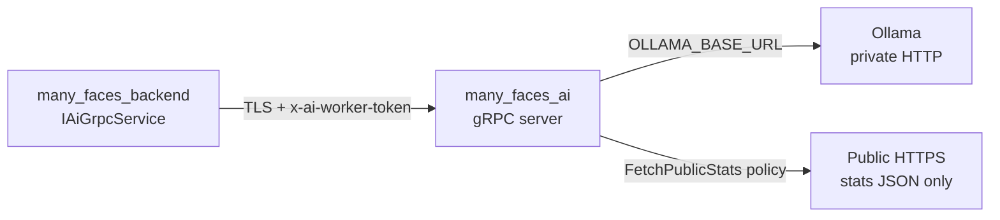
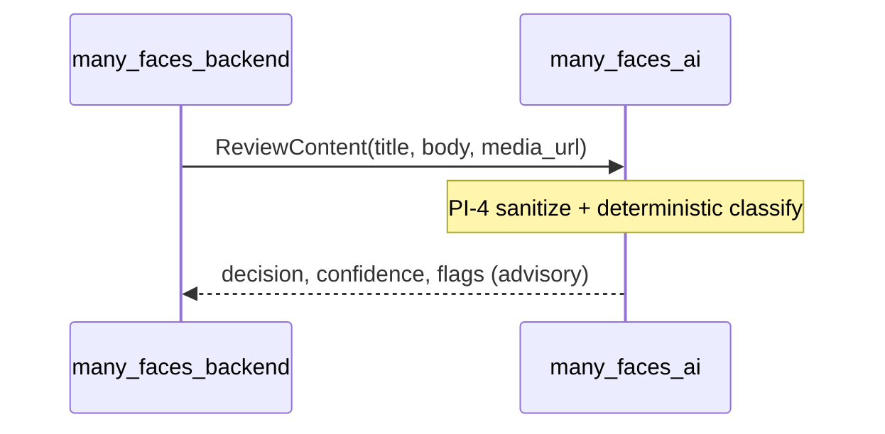

# Security guide — many_faces_ai (AI worker)

Internal **Python gRPC adapter** for the Many Faces platform. This service is **not** user-facing: only **many_faces_backend** should call it on a private network.

## 1. What this service is

- Exposes gRPC on port **50051** (configurable via `PORT`).
- Proxies **Ollama** chat completion for operator **`Generate`** / **`OperatorStatsChat`**.
- Returns deterministic **`ReviewContent`** moderation recommendations (advisory only).
- Optionally fetches **public HTTPS JSON** via **`FetchPublicStats`** (SSRF-hardened).
- Collects **`GetHostProfile`** host metadata for the admin settings panel.

The worker **never** writes to PostgreSQL or publishes content.

## 2. Trust boundaries

**Untrusted input:** `ReviewContent` title, body, media URL (creator content).

**Trusted-operator boundary:** `Generate`, `OperatorStatsChat`, and embedded `stats_context_json` — backend ACL ensures only operators reach these RPCs.

## 3. Who may call gRPC

| Caller                             | Allowed                             |
| ---------------------------------- | ----------------------------------- |
| `many_faces_backend` worker client | Yes (intended production path)      |
| Portal / admin SPA                 | No direct gRPC                      |
| Mobile app                         | No direct gRPC                      |
| Public internet                    | No (keep off host firewall in prod) |

## 4. Authentication

Metadata key: **`x-ai-worker-token`**

| Profile           | Behavior                                                                                              |
| ----------------- | ----------------------------------------------------------------------------------------------------- |
| **Dev** (default) | Auth disabled when `AI_WORKER_EXPECTED_TOKEN` is empty                                                |
| **Hardened**      | `MFAI_REQUIRE_WORKER_AUTH=1` requires non-empty token at startup                                      |
| **HealthCheck**   | Public by default (orchestration probes). Optional `MFAI_HEALTHCHECK_REQUIRES_TOKEN=1` requires token |

Token comparison uses constant-time `secrets.compare_digest`.

Align backend env: `AiService__WorkerAuthToken` ↔ `AI_WORKER_EXPECTED_TOKEN`.

## 5. TLS

| Variable                     | Purpose                                         |
| ---------------------------- | ----------------------------------------------- |
| `GRPC_TLS_CERT_FILE`         | Server certificate (PEM)                        |
| `GRPC_TLS_KEY_FILE`          | Server private key (PEM)                        |
| `MFAI_ALLOW_INSECURE_GRPC=1` | Dev/hardened escape hatch when TLS files absent |

Backend client should use HTTPS gRPC (`AiGrpcService` + `GrpcWorkerChannelFactory`).

Smoke script: `./scripts/smoke-grpc-tls.sh` (plaintext HealthCheck + TLS path when certs exist).

## 6. Environment variables

| Name                                       | Required in prod | Dev example                         | Notes                                           |
| ------------------------------------------ | ---------------- | ----------------------------------- | ----------------------------------------------- |
| `AI_WORKER_EXPECTED_TOKEN`                 | Yes (hardened)   | _(empty = auth off)_                | Never commit real values                        |
| `MFAI_REQUIRE_WORKER_AUTH`                 | Yes              | `0`                                 | Fail startup if token missing                   |
| `MFAI_ALLOW_INSECURE_GRPC`                 | No               | `1` in dev compose                  | Required without TLS in hardened                |
| `GRPC_TLS_CERT_FILE` / `GRPC_TLS_KEY_FILE` | Recommended      | —                                   | Enable gRPC TLS listener                        |
| `MFAI_HEALTHCHECK_REQUIRES_TOKEN`          | Optional         | `0`                                 | Lock down HealthCheck                           |
| `OLLAMA_BASE_URL`                          | Yes              | `http://host.docker.internal:11434` | Hardened allow-list only                        |
| `OLLAMA_MODEL`                             | Yes              | `qwen2.5:7b-instruct-q4_K_M`        | Local model name                                |
| `MFAI_LLM_MODERATION`                      | No               | `0`                                 | Enable LLM moderation path (**0.9.0**)          |
| `OLLAMA_MODEL_MODERATION`                  | No               | falls back to `OLLAMA_MODEL`        | Moderation model profile                        |
| `MODERATION_RULES_AUTO_THRESHOLD`          | No               | `0.88`                              | Skip LLM when rules reject with high confidence |
| `MFAI_ALLOW_HTTP_LOOPBACK`                 | Dev only         | implicit in dev                     | HTTP stats fetch to 127.0.0.1                   |
| `AIH1_RPC_RATE_PER_MIN`                    | Optional         | unset                               | Per-method RPC rate limit (per minute)          |
| `AIH1_RPC_RATE_REDIS_URL`                  | Optional         | unset                               | Distributed limit via shared Redis (else local) |
| `PORT`                                     | No               | `50051`                             | gRPC listen port                                |

See [`.env.example`](../.env.example) for the full list.

## 7. RPC reference (security)

| RPC                        | Input trust                  | Egress                      | Auth (hardened)   |
| -------------------------- | ---------------------------- | --------------------------- | ----------------- |
| `HealthCheck`              | N/A                          | None                        | Optional (see §4) |
| `Generate`                 | Trusted operator             | Ollama                      | Required          |
| `OperatorStatsChat`        | Trusted operator             | Ollama + optional stats URL | Required          |
| `FetchPublicStats`         | URL string                   | HTTPS (SSRF policy)         | Required          |
| `ReviewContent`            | **Untrusted** creator fields | Optional Ollama (LLM path)  | Required          |
| `GenerateStream`           | Trusted operator             | Ollama stream               | Required          |
| `BuildFaceContextSnapshot` | Trusted operator             | Ollama + DB context         | Required          |
| `ChatRiskScore`            | Trusted operator             | Ollama                      | Required          |
| `GenerateReport`           | Trusted operator             | Ollama                      | Required          |
| `EmbedText`                | Trusted operator             | Ollama embeddings           | Required          |
| `ExplainDecision`          | Trusted operator             | Ollama                      | Required          |
| `GetHostProfile`           | N/A                          | Local OS introspection      | Required          |

**Proto change gate:** any new/changed RPC in `health.proto` needs a row here plus **AIH1-T-\*** tests before merge.

## 8. ReviewContent / moderation

- **`moderation_input_sanitize.py`** strips bidi/control chars; caps title 200, body 100k, media URL 2000 chars (PI-4 parity with backend).
- **Rules classifier** runs first (deterministic keyword + media URL heuristics).
- When **`MFAI_LLM_MODERATION=1`**, boundary cases invoke Ollama via **`review_with_llm`**; invalid JSON falls back to **`needs_human_review`**. See [`docs/moderation-llm-phase3.md`](./moderation-llm-phase3.md).
- Worker output is **advisory**; backend validates ranges and owns final approval status.
- Guide: [ai-assisted-content-approval.md](../../docs/guides/ai-assisted-content-approval.md)

## 9. FetchPublicStats / SSRF

Worker-side policy (`utils/outbound_url_policy.py`) mirrors backend `OutboundUrlAllowlist`:

- **HTTPS** to public hosts only (blocks private RFC1918, link-local, metadata IP, `.internal`).
- **HTTP** only to loopback when dev flag allows (`127.0.0.1`, `localhost`).
- Rejects `javascript:`, `file:`, userinfo in URL.
- Max response **2 MiB**; redirects not followed to untrusted targets.

## 10. Production checklist

- [ ] Set `AI_WORKER_EXPECTED_TOKEN` and matching backend token
- [ ] Enable gRPC TLS (`GRPC_TLS_*`) or document explicit insecure exception
- [ ] Do **not** publish port 50051 to the host (`TRACK-AIH1-HOST-PORT`)
- [ ] Place Ollama on a **private Docker network** — worker egress only to Ollama + allowed HTTPS stats hosts
- [ ] Pin `OLLAMA_BASE_URL` to allow-listed hostnames
- [ ] Run `node scripts/verify-ai-security-tests.mjs` from monorepo root in CI
- [ ] Optional: `./scripts/smoke-grpc-tls.sh` after deploy

## 11. Known limitations & deferrals

| Track ID               | Topic                                                                              |
| ---------------------- | ---------------------------------------------------------------------------------- |
| `TRACK-AIH1-MTLS`      | Full mutual TLS instead of shared metadata token — see [`docs/mtls.md`](./mtls.md) |
| `TRACK-AIH1-HOST-PORT` | Removing dev compose `50051:50051` host publish                                    |

**Shipped (0.9.0):** LLM moderation path (**AI-UP1**), capability RPCs (**AI-UP1…20**). Roadmap: [`docs/capability-roadmap-v0.9.0.md`](./capability-roadmap-v0.9.0.md) · media pass: [`docs/moderation-media-pass.md`](./moderation-media-pass.md).

**Shipped (`TRACK-AIH1-REDIS`):** the per-method RPC rate limit (`AIH1_RPC_RATE_PER_MIN`) is now **distributed** when `AIH1_RPC_RATE_REDIS_URL` is set — a shared Redis fixed-window counter (`INCR` + 60s `EXPIRE`) coordinates the limit across worker replicas. The `redis` package is imported lazily only when that URL is set, so the base worker keeps no hard Redis dependency, and the limiter **fails open** (and falls back to the in-process counter) if Redis is missing or unreachable, so an outage never hard-blocks inference. See `utils/rpc_rate_limit.py`.

## 12. Reporting issues

Report security concerns in the **many_faces_main** monorepo issue tracker. Do not paste production tokens or TLS private keys in public tickets.

---

**CI:** `tests/**/*_security.py` with ids **AIH1-T-\***; gate script `scripts/verify-ai-security-tests.mjs` (monorepo root).
