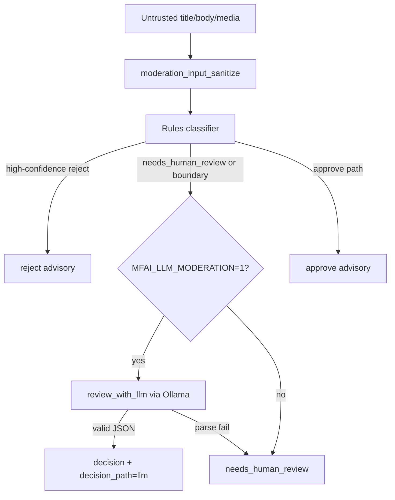

# LLM moderation phase 3 (AI-UP1)

Optional LLM path for **`ReviewContent`** when **`MFAI_LLM_MODERATION=1`**.

## Decision flow

1. Rules classifier runs first (unchanged AIH1 behavior).
2. High-confidence rules **reject** skips LLM (`MODERATION_RULES_AUTO_THRESHOLD`, default `0.88`).
3. **`needs_human_review`** or boundary-only flags invoke **`review_with_llm`**.
4. Invalid LLM JSON → **`needs_human_review`** with flag **`llm_parse_fail`**.

## Environment

| Variable                            | Default                      | Purpose                                          |
| ----------------------------------- | ---------------------------- | ------------------------------------------------ |
| `MFAI_LLM_MODERATION`               | `0`                          | Enable LLM moderation                            |
| `OLLAMA_MODEL_MODERATION`           | falls back to `OLLAMA_MODEL` | Moderation model profile                         |
| `MODERATION_RULES_AUTO_THRESHOLD`   | `0.88`                       | Skip LLM when rules reject with high confidence  |
| `MFAI_LLM_MODERATION_SKIP_BOUNDARY` | unset                        | When `1`, skip LLM for boundary-only media flags |

## Response fields

Proto **`ContentReviewResponse`** adds **`auto_approve_eligible`**, **`policy_hint`**, **`decision_path`** (`rules` | `llm`).

## Security

- Untrusted title/body/media URL pass through **`moderation_input_sanitize`** first.
- LLM prompts never log raw body at INFO (see **`handlers.rpc_handlers`** `title_len` / `body_len` only).
