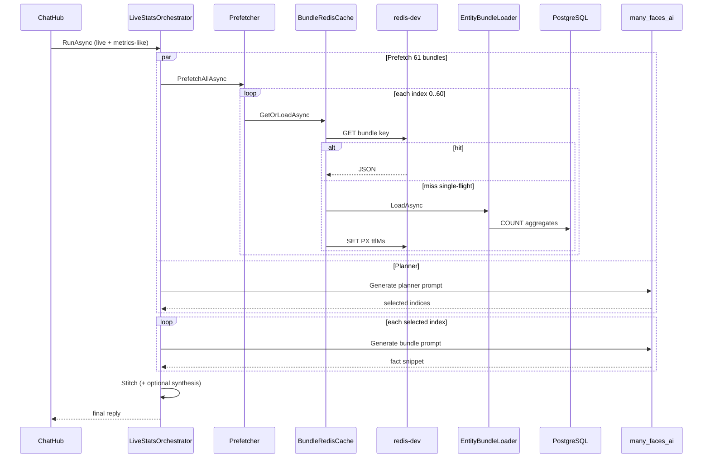
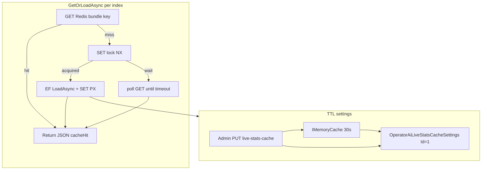

# Operator live stats — live map-reduce (v1)

Canonical reference for **admin operator AI `live` stats mode** (map-reduce over 61 EF entity bundles). Stage 1 uses **Redis cache-aside** (see runbook).

## Architecture (Option B — backend orchestrator)

| Stage | Where | What |
| --- | --- | --- |
| 1 | **Backend** (`OperatorAiLiveStatsPrefetcher`) | Prefetch **all 61** entity bundles — **Redis L2 cache-aside** + DB on miss (**not** LLM) |
| 2 | **Backend + `Generate` gRPC** | Planner LLM call returns JSON `{"indices":[...]}` (skipped for broad-overview questions) |
| 3 | **Backend** | Per-index barrier — wait until bundle JSON ready |
| 4 | **Backend + `Generate` gRPC** | Queued per-bundle AI (max **N** parallel, default **2**) |
| 5 | **Backend** (`OperatorAiLiveStatsStitch`) | Deterministic stitch → one operator reply (optional AI synthesis) |

**Gate:** `OperatorAiStatsIntent.IsMetricsQuestion` — non-metrics **`live`** messages skip stages 1–5 and use plain **`Generate`**.

Python modules `live_stats_planner.py` and `live_stats_stitch.py` mirror parse/stitch logic for unit tests; **orchestration runs in C#** today.

## End-to-end flow (mermaid)



## Redis cache layer (stage 1 only)



| Item | Value |
| --- | --- |
| Key prefix | `bedemo:operator-ai:live-bundle:v{catalogVersion}:idx:{index}` |
| Lock prefix | `bedemo:operator-ai:live-bundle:lock:v…` |
| Default TTL | 300_000 ms (5 min), Admin-configurable |
| Job queue keys | `bedemo:jobs:*` — **separate namespace** |

## Key backend types

- `many_faces_backend/BeDemo.Api/Services/OperatorAi/OperatorAiEntityBundleCatalog.cs` — indices 0–60, `CatalogVersion = 2`
- `OperatorAiEntityBundleLoader.cs` — aggregate queries per entity
- `OperatorAiLiveStatsOrchestrator.cs` — full pipeline
- `OperatorAiBundleRedisCache.cs` — stage 1 Redis cache (backend-only; Python unchanged)
- `OperatorAiLiveStatsCacheSettingsService.cs` — L1 + PostgreSQL TTL singleton
- `OperatorAiLiveBundleCacheStartupWarm.cs` — optional background warm (`WarmLiveBundleCacheOnStartup`)
- `ChatHub.SendToAiWithOperatorStats(..., maxParallelBundleAiCalls?)` — `live` branch only

## Configuration

`OperatorAi` section in backend `appsettings.json`:

- `MaxParallelBundleAiCalls` (default 2) — server cap; admin sends preference via hub
- `MaxSelectedBundleIndices` (default 4)
- `LiveTotalTimeoutSeconds`, `LivePrefetchTimeoutSeconds`, token limits
- `LiveBundleCacheTtlMilliseconds` (300000), `LiveBundleCacheSettingsMemoryCacheSeconds` (30)
- `WarmLiveBundleCacheOnStartup` (false), `WarmLiveBundleCacheStartupDelaySeconds` (5), `WarmLiveBundleCacheStartupTimeoutSeconds` (120)

Admin browser:

- `localStorage` **`admin_ai_live_max_parallel_bundle_calls`** (1–8)
- **Cache TTL** — server DB via Settings → **`PUT /admin/api/operator-ai/live-stats-cache`**

## Tests

```bash
# Backend (map-reduce + Redis cache)
dotnet test --filter FullyQualifiedName~OperatorAi

# Python (from many_faces_ai/)
PYTHONPATH=. pytest tests/test_live_stats.py -q

# Admin
yarn test --run src/utils/__tests__/adminAiLiveParallelSettings.test.ts
yarn test --run src/utils/__tests__/adminAiLiveStatsCacheSettings.test.ts
```

## Related

- Agent prompts: `docs/prompts/admin-operator-ai-live-stats-bundle-map-reduce-agent-prompt.md`, `docs/prompts/operator-ai-live-stats-redis-cache-agent-prompt.md`
- Runbook: `docs/guides/backend-stats-and-admin-ai-runbook.md`
- Redis: `docs/readmes/redis-subrepo.md`
